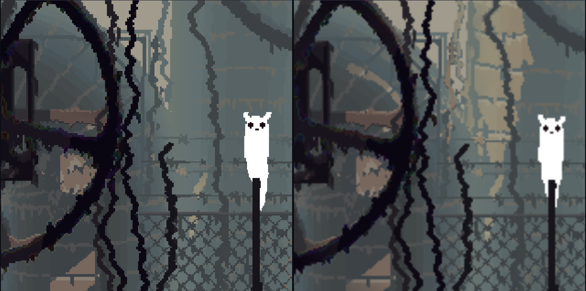
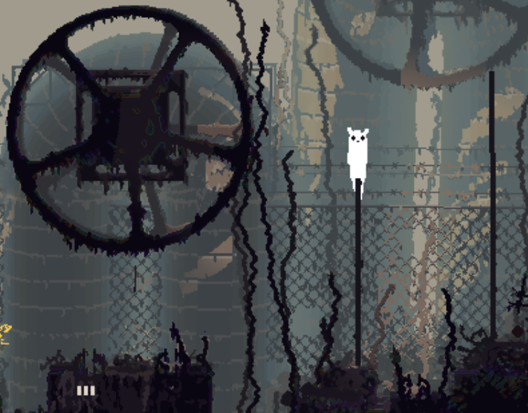
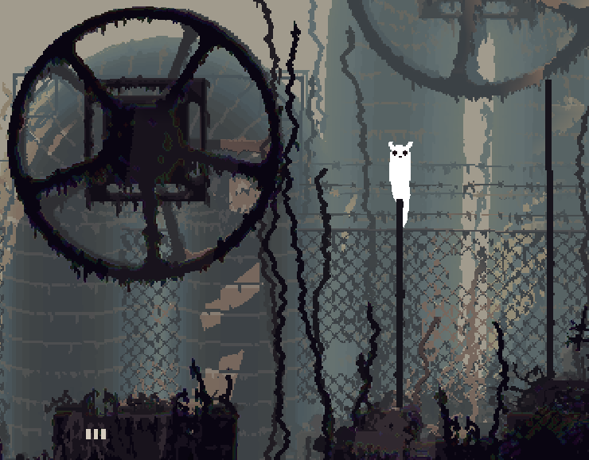

# Rain World — True Resolution

Makes Rain World render at your monitor's actual resolution instead of the tiny
fixed internal buffer it ships with, **without changing how much of the room you
can see**.

Built and tested against **Rain World v1.11.8** (Downpour + Watcher),
Unity 2020.3.45f1, BepInEx 5.4.17.



*Left: True Resolution. Right: vanilla. Same room, same crop, both at 400% zoom
on a 1440p display.*

---

## Install (Windows, no build tools)

This is the path for almost everyone. You do not need Visual Studio, the .NET
SDK, or a compiler.

**1.** Download `RainWorld-TrueResolution-vX.Y.Z.zip` from the
[Releases page](../../releases/latest).

**2.** Find your Rain World folder. In Steam: right-click **Rain World** →
**Manage** → **Browse local files**. You want the folder containing
`RainWorld.exe`. It is usually one of:

```
C:\Program Files (x86)\Steam\steamapps\common\Rain World
D:\SteamLibrary\steamapps\common\Rain World
```

**3.** Go into `RainWorld_Data\StreamingAssets\mods\`. That folder already exists
and already has things in it (`moreslugcats`, `dlc-shared`, and so on) — you are
adding one more folder next to them.

**4.** Extract the zip **into that `mods` folder**. When you are done it must
look **exactly** like this:

```
Rain World\
└── RainWorld_Data\
    └── StreamingAssets\
        └── mods\
            ├── moreslugcats\          <- already there, leave it alone
            ├── dlc-shared\            <- already there, leave it alone
            └── trueresolution\        <- NEW, from the zip
                ├── modinfo.json
                ├── thumbnail.png
                └── plugins\
                    └── TrueResolution.dll
```

Two things go wrong here, so check both:

- **Do not nest it.** If you see `mods\trueresolution\trueresolution\modinfo.json`,
  you extracted one level too deep. Move the inner folder up.
- **`modinfo.json` must sit directly inside `trueresolution\`**, and the DLL must
  sit inside `trueresolution\plugins\`. The game reads `modinfo.json` from the mod
  folder root and scans only `plugins\` for code.

**5.** Launch the game. Main menu → **Remix** → find **True Resolution** in the
list → tick it → **Apply** → let it restart.

**6.** Done. Then read [Recommended settings](#recommended-settings), because one
in-game option matters.

### Uninstall

Delete `RainWorld_Data\StreamingAssets\mods\trueresolution\`. Optionally also
`BepInEx\config\steinkoloss.trueresolution.cfg`.

---

## Install (Linux, macOS, Steam Deck)

> ### Linux/Proton/Steam Deck: do this first or nothing will happen
>
> Rain World is a Windows build. Under Proton, Wine loads its own builtin
> `winhttp.dll` and ignores the BepInEx shim in the game folder, so **no mod of
> any kind loads** — silently, with no error anywhere.
>
> Steam → Rain World → Properties → **Launch Options**:
>
> ```
> WINEDLLOVERRIDES="winhttp=n,b" %command%
> ```
>
> Launch once, then confirm BepInEx actually ran:
>
> ```bash
> ls "$HOME/.local/share/Steam/steamapps/common/Rain World/BepInEx/LogOutput.log"
> ```
>
> If that file does not exist, stop and fix this before anything else.

Then either extract the release zip into
`RainWorld_Data/StreamingAssets/mods/` exactly as in the Windows section above,
or build from source:

```bash
./install.sh
```

It finds Rain World by reading every Steam library out of `libraryfolders.vdf`
(so a game on a second drive or an SD card is found automatically), builds,
installs, and prints the exact commands to verify the result. Override with
`RW_DIR=/path/to/Rain\ World ./install.sh`.

On Windows with the .NET SDK installed, the equivalent is:

```powershell
.\install.ps1
# or:  .\install.ps1 -RainWorldDir "D:\SteamLibrary\steamapps\common\Rain World"
```

If PowerShell refuses to run it, use
`powershell -ExecutionPolicy Bypass -File .\install.ps1`.

---

## Recommended settings

**Set the in-game resolution option to 1366×768.** Options → the resolution
dropdown.

Every entry in that list is 768 tall; only the width changes. `1366×768` is the
only one whose aspect ratio matches the constant Futile hardcodes for its aspect
correction (`1.7786459` = 1366÷768). The game's default is `1360×768`, which is
0.4% off and gets very slightly stretched. Same height, no performance cost, so
there is no reason to pick anything else.

---

## What you should expect to see

**Genuinely sharper** — everything drawn procedurally as meshes and sprites: the
slugcat, all creatures, rain, water surfaces, spears, particles, lighting
effects, the HUD and all text.

**Hard-capped by the source art** — room terrain and backgrounds are 1400×800
PNGs, one per screen. They cannot gain detail nobody ever drew. They do stop
being scaled twice, so they get *cleaner*, not *more detailed*.

**Not a wider field of view.** This is the deliberate design limit, not an
oversight. See [what is not done](#what-is-explicitly-not-done).

| True Resolution | Vanilla |
|---|---|
|  |  |

### 1920×1080

The common case, and the one this helps most. You get a native 1920×1080
backbuffer instead of a 1366×768 one stretched up by your monitor, plus a
2× supersampled render texture (what Auto picks there). Expect a clearly
crisper image.

### Ultrawide and other non-16:9 displays (3440×1440, 5120×1440, 4:3, 16:10)

The picture is at most ~16:9, because that is the widest thing the game's own
resolution list contains. On a wider display the mod takes the full native
backbuffer and fits the ~16:9 picture inside it at maximum size, centred, with
black bars on the left and right (`AspectMode = Letterbox`, the default).

**You will have black bars on an ultrawide, and that is correct.** The
alternative is not "more game on screen" — it is the same picture stretched
horizontally, because Rain World's camera image is a full-stretch overlay and
nothing widens the actual view. If you would rather have the stretch, tick
**Stretch to fill screen** on the mod's Remix page (the option only appears on
non-16:9 displays).

This is the **least-verified** part of the mod. It has been tested on 2560×1440
(16:9). If you have an ultrawide, a 4:3 panel, or multiple monitors, a
[compatibility report](../../issues/new?template=compatibility.yml) with your
`display probe` and `presentation:` log lines is genuinely useful.

---

## The problem this fixes

Rain World's resolution options top out at **1366×768**, and every entry is 768
tall:

| | |
|---|---|
| `Options.screenResolutions` | `1024×768`, `1366×768`, `1360×768`, `1280×768`, `1229×768` — all 768 tall |
| `FScreen` constructor | `pixelHeight = 768;` — a literal |
| `Options.OnLoadFinished` | `Screen.SetResolution((int)ScreenSize.x, (int)ScreenSize.y, ...)` |

So the image is degraded **twice**:

1. Everything is rasterized into a `RenderTexture` only 768 pixels tall.
2. The game window is *also* forced down to 768 tall, and your monitor then
   stretches that up to the panel — a non-integer blow-up that happens outside
   the engine entirely, where nothing can filter it well.

## The fix

Two independent changes, neither of which touches world-space framing:

**1. Native backbuffer.** In fullscreen, present at your display's real
resolution instead of letting the game shrink the window. The single biggest
visual win, and not a "resolution increase" — it just stops throwing pixels away
at the last step.

**2. Supersampling.** `FScreen` already has a `renderScale` multiplier that sizes
the render texture (`pixelWidth * renderScale` by `pixelHeight * renderScale`),
but the constructor pins it to `1`. The Futile camera's `orthographicSize` derives
from `pixelHeight`, **not** from the render texture size — so raising
`renderScale` increases pixel density while showing the *exact* same slice of the
world. Framing is invariant by construction, not by arithmetic that could round
wrong.

This is a path the developers clearly anticipated but never shipped:

- `RainWorld.Update` branches on `Futile.screen.renderScale > 1` to retune the
  hologram shader.
- `FScreen.UpdateScreenOffset` has a dedicated `renderScale != 1` branch for the
  sub-texel offset.

Both are dead code in stock Rain World.

### What is explicitly *not* done

Raising `pixelWidth`/`pixelHeight`, or adding taller entries to
`Options.screenResolutions`, **would** give a bigger picture — and would break
the game. Those values are world units, not just pixels:
`RoomCamera.GetVisibleRect` returns `new Rect(pos, sSize)`, and room art is a
fixed 1400×800 image per screen. At 2560×1440 you would get roughly 580 px of
empty void per side, plus around forty culling and camera-switching predicates
that still believe the window is 768 tall.

This mod never writes `FScreen.pixelWidth`, `FScreen.pixelHeight`,
`Options.screenResolutions` or `Options.ScreenSize`.

---

## Performance

**Short version: you do not need to configure anything.** The default
(`Render quality = Auto`) picks the cheapest clean setting for your display.
If a heavy rain room ever dips on old hardware, set `Render quality = 1` —
you keep the native backbuffer, which is the bigger half of the benefit,
for free.

The two halves of this mod cost wildly different amounts:

- **The native backbuffer is nearly free.** It presents at your real resolution
  instead of letting the game shrink the window. No extra rendering, and it is
  the single biggest visual improvement.
- **Render quality is the expensive half**, and its cost scales with the
  *square* of the value.

What you are actually rendering, on a 1366×768 logical screen:

| Render quality | Render target | Megapixels | Target VRAM |
|---|---|---|---|
| 1 | 1366×768 | 1.0 | ~4 MB |
| 2 (= Auto on 1080p/1440p) | 2732×1536 | 4.2 | ~17 MB |
| 3 (= Auto on 4K) | 4098×2304 | 9.4 | ~38 MB |
| 4 | 5464×3072 | 16.8 | ~67 MB |
| 8 | 10928×6144 | 67.1 | ~268 MB |

**Higher values keep helping, and it is worth understanding why**, because it is
not "more texture detail" — the room artwork really is a fixed 1400×800 image.

That image is `FilterMode.Point` (`PersistentData.cs:18`). In vanilla it is drawn
1:1 into a 768-tall buffer, and then your *monitor* stretches that to the panel by
a non-integer factor, blurring across every hard pixel-art boundary. That happens
outside the engine, where nothing can control it, and it is the single biggest
reason vanilla looks soft.

Supersampling moves that magnification **inside** the engine, where it is done
with hard pixels. On top of that, a denser render quantises positions more finely:
the level graphic sits at fractional camera coordinates, so at 1x every edge snaps
to a whole pixel, while at 8x it resolves to an eighth of one. Edges land where
they belong and stop crawling as the camera pans.

So if you want more than Auto, raise the value until the framerate stops being
comfortable — the returns are real but they shrink each step.

### Will it run on my GPU?

Measured: an RX 9070 XT holds a 360 Hz refresh cap in-game at `Render quality = 4`,
so it was never the bottleneck. Everything below that is **estimated from memory
bandwidth**, which is the right proxy because the cost here is dominated by
Rain World's grab passes — the shader library declares 112 of them, 81 unnamed,
and an unnamed grab copies the entire render target once per drawing object.
Only shaders for effects present in the current room execute, so the real cost
swings a lot between a bare corridor and a rain-soaked, water-filled room.

| Tier | Suggested setting |
|---|---|
| Modern mid-range and up (RX 6700 XT / RTX 3060 and better) | Auto, or `3–4` if you want to experiment |
| Budget/older (RX 6500 XT, RTX 3050, GTX 1650) at 1080p | Auto should be comfortable; drop to `1` if a heavy rain room dips |
| 4 GB cards at 1440p or 4K | Auto is still fine. The limit is fill rate, not memory — even at `8` the render target is only ~270 MB |
| Integrated graphics / Steam Deck | `1`. The native backbuffer still helps and costs nothing |

If you are chasing a number, note that **frames per second will not tell you the
cost if you are hitting a refresh cap or v-sync** — watch GPU utilisation or
frame time instead.

---

## Config

`BepInEx/config/steinkoloss.trueresolution.cfg`, written on the first successful run.
If the file is not there, the plugin never loaded — see
[troubleshooting](#troubleshooting).

The normal way to change settings is in game: main menu → **Remix** →
**True Resolution** → the cog icon. There is one slider (**Render quality**,
default Auto) and, on non-16:9 displays only, a **Stretch to fill screen**
tick box. Changes apply immediately.

The config file holds the same values plus troubleshooting overrides:

| Key | Default | Meaning |
|---|---|---|
| `RenderQuality` | `0` | `0` = Auto: the smallest integer scale that covers the picture (2× on 1080p/1440p, 3× on 4K). `1`–`8` force a fixed scale. |
| `NativeBackbuffer` | `true` | Present at native resolution in fullscreen. Windowed mode is left alone deliberately. Troubleshooting off-switch. |
| `AspectMode` | `Letterbox` | `Letterbox` fits the ~16:9 picture inside the native backbuffer with bars. `Stretch` reverts to vanilla full-stretch. `AspectBackbuffer` asks Unity for an already-correct backbuffer instead (a fallback; unreliable on some drivers). |
| `TargetWidth` / `TargetHeight` | `0` | `0` = auto-detect. Set **both** if the log shows the wrong display. |

**If the framerate drops, set `Render quality = 1`.** You keep the
native-backbuffer win, which is the larger of the two improvements anyway.

---

## Troubleshooting

Everything below is answered by the log. Windows:

```powershell
Select-String -Path "C:\Program Files (x86)\Steam\steamapps\common\Rain World\BepInEx\LogOutput.log" `
  -Pattern 'True Resolution|display probe|render texture is now|backbuffer:|FScreen:|presentation:'
```

Linux/macOS:

```bash
grep -E 'True Resolution|display probe|render texture is now|backbuffer:|FScreen:|presentation:' \
  "$HOME/.local/share/Steam/steamapps/common/Rain World/BepInEx/LogOutput.log"
```

A healthy run on a 2560×1440 display looks like:

```
True Resolution 1.0.1 loaded. cfg: supersample=2 nativeBackbuffer=True target=auto ...
display probe: chose 2560x1440 via 'Screen.currentResolution'
render texture is now 2732x1536 (logical 1366x768, 2x supersampled)
backbuffer: CONFIRMED 2560x1440 mode=FullScreenWindow after 1 frames
```

| Symptom | Cause and fix |
|---|---|
| `LogOutput.log` does not exist at all | BepInEx is not injecting. On Linux/Proton, apply the `WINEDLLOVERRIDES` launch option above. On Windows, verify the game files in Steam — `winhttp.dll` and `doorstop_config.ini` must be next to `RainWorld.exe`. |
| Log exists, but no `True Resolution` line | The mod folder is in the wrong place or not enabled. Check the [exact layout](#install-windows-no-build-tools), then Remix → enable → Apply → restart. |
| Worked before, stopped after a game update | Re-enable it in Remix. The loader blanks the enabled-mods list whenever the game version string changes. |
| `display probe` shows the wrong resolution | Set `TargetWidth` and `TargetHeight` explicitly in the config. |
| `backbuffer: SetResolution(...) did not take effect` | The display refused the mode. Set `TargetWidth`/`TargetHeight` to a mode your monitor actually has. |
| Nothing changes, and you are in windowed mode | `NativeBackbuffer` is fullscreen-only by design. Supersampling still applies. |
| Framerate dropped | `Render quality = 1`. |
| Image looks stretched on an ultrawide | Set `AspectMode = Letterbox` (the default). If it is already that, file a compatibility report. |

---

## Known issues and conflicts

**Conflicts with other rendering mods.** These all target the same thing and
should not be run alongside this one:

- **[Sharpener](https://steamcommunity.com/sharedfiles/filedetails/?id=2920451662)**
  (`pjb3005.sharpener`) — hooks Unity's `Screen` class to lie to the game about
  the resolution. Both mods then fight over the backbuffer. Sharpener also
  requires patched shaders (`_ShaderFix.cginc`) because it renders with an
  inverted Y projection; this mod does not, since the game already renders into a
  render texture natively.
- **[No More Fullscreen Blur](https://steamcommunity.com/sharedfiles/filedetails/?id=3128781476)**
  — built to be used *with* Sharpener.
- **[PixelPerfect](https://steamcommunity.com/sharedfiles/filedetails/?id=3606068896)**
  / **PixelPerfectFor1080p** — crop-based approach, incompatible aims.
- **[Number Fixes](https://steamcommunity.com/sharedfiles/filedetails/?id=3354169038)**
  — includes its own fix for the fullscreen pixelation, so at minimum redundant.

**Minor, from this mod:**

- **Remix menu draggers are ~1.9× more sensitive.** `OpDragger.Update` divides a
  raw backbuffer-pixel delta by a hardcoded `10f` instead of normalising by
  screen height like every other menu path, so a taller backbuffer speeds it up.
  Cosmetic, menus only. Fixable with an IL hook.
- **Watcher ripple/camo masks stay at the logical size.** `RippleCameraData`
  sizes them from `pixelWidth`/`pixelHeight` with no `renderScale`, so at 2× they
  are lower-resolution than their surroundings. Not a regression versus vanilla —
  an improvement that did not propagate.
- `renderScale > 1` activates `FScreen.UpdateScreenOffset`'s non-`1` branch,
  which is dead code in stock Rain World. With integer-multiple render targets —
  the only kind this mod creates — its constants are exactly correct, and long
  play sessions at 2×–8× have shown no misalignment.

**Untested territory:** ultrawide and multi-monitor, 4:3 and 16:10 panels, the
OpenGL rendering path, macOS, and native Linux. The only machine this has been
verified on is 2560×1440 / 16:9 / D3D11 / AMD / Proton, which is the easy case.
[Compatibility reports](../../issues/new?template=compatibility.yml) welcome.

---

## Version compatibility

Tested against **v1.11.8**. `modinfo.json` declares `target_game_version:
"v1.11"`, so Remix treats the mod as current for the whole 1.11 line and flags it
as outdated at v1.12 — which is when the rendering internals might actually move.

**The mod warns; it never refuses to load.** Nothing it does can corrupt a save —
it writes a render-texture size and a backbuffer size, and never touches the
world-unit values. A wrong guess on a future version means a soft or mis-scaled
image, which is strictly better than refusing to start. If a hook this mod needs
disappears entirely, BepInEx fails the hook registration and disables the plugin
without any help from us. Reasoning in
[docs/RELEASING.md](docs/RELEASING.md#version-compatibility).

---

## Building from source

Needs the [.NET SDK](https://dotnet.microsoft.com/download) (6 or newer) and a
Rain World installation.

```bash
dotnet build -c Release
```

The build finds the game itself — every Steam library in `libraryfolders.vdf`
across all drives, plus common GOG/Epic/manual locations, on Windows, Linux and
macOS. Override with `-p:RainWorldDir="/path/to/Rain World"` or `RW_DIR`. If it
cannot find it you get one actionable error (`RWFIX001`), not nine `CS0246`s.

Output:

- `bin/Release/TrueResolution.dll` — the plugin
- `bin/mod/trueresolution/` — the drop-in mod folder, correct layout
- `bin/dist/*.zip` — with `-t:PackageMod`

Three of the referenced assemblies (`Assembly-CSharp`, `HOOKS-Assembly-CSharp`,
`UnityEngine.UI`) ship with the game and are not redistributable, which is why
there is no committed `lib/` folder here and why CI cannot simply build this.
Everything else comes from NuGet pinned to the exact versions the game ships.
Full explanation, plus how to build with no game installed, in
[docs/RELEASING.md](docs/RELEASING.md).

Repo layout:

```
src/                  plugin source
mod/                  modinfo.json and thumbnail.png -> mod folder root
build/                game detection, mod staging, zip packaging
tools/make-refs.sh    reference assemblies, for building without the game
tools/check-metadata.py   validates modinfo/versions/thumbnail (CI runs this)
tools/release.sh      build, validate, package, publish
docs/RELEASING.md     CI options, Steam Workshop and RainDB submission
```

---

## Licence

[MIT](LICENSE) for the source in this repository.

Rain World is copyright Videocult / Adult Swim Games / Akupara Games. This is an
unofficial, unaffiliated mod. It contains no Rain World code or assets — the
distributed artifact is a single DLL of original code that binds against
assemblies already present on your machine.
